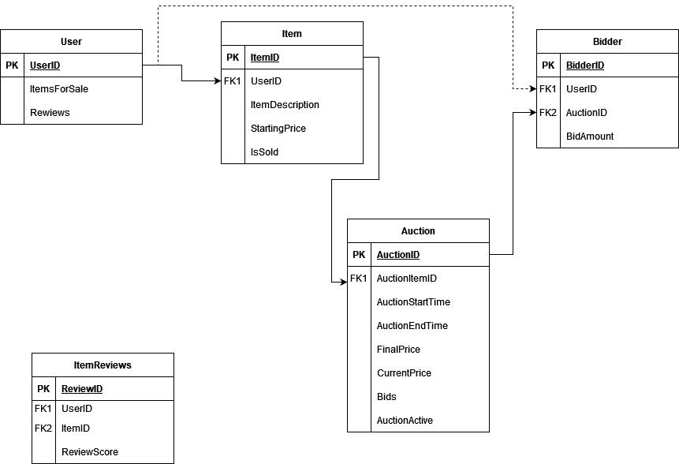

# ModernAuction
## This project creates an auction website application using Asp.net MVC

# DbSet<> objects                     
- Users
- Items
- Auctions
- Bidders

# Project overview
### The goal is to create a Auction website users should be able to:

## Minimal Viable Product Goals
- put an item up for sale or a set amount of time
- have other users bid on said item
- allow for bidders to leave reviews after purchase
- users should be able to view their bid history

## Extended Goals
- Allow for users to have a rating score assigned to them based off there reviews
- Allow for users to put in a maximum bid and have the application automatically increase their bid
- Have users be able to enter shipping preferences for after they have one a bid
- have users be able to message each other about items for sale
- setting static buy now prices of items up for bid

